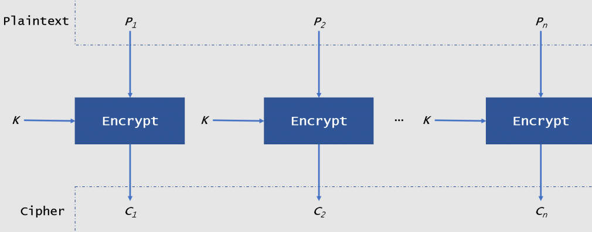
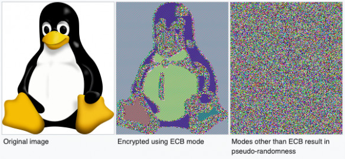

**Cryptohack - ECB Oracle**

## Target

> ECB is the most simple mode, with each plaintext block encrypted entirely independently. In this case, your input is prepended to the secret flag and encrypted and that's it. We don't even provide a decrypt function. Perhaps you don't need a padding oracle when you have an "ECB oracle"?

```python
from Crypto.Cipher import AES
from Crypto.Util.Padding import pad, unpad


KEY = ?
FLAG = ?


@chal.route('/ecb_oracle/encrypt/<plaintext>/')
def encrypt(plaintext):
    plaintext = bytes.fromhex(plaintext)

    padded = pad(plaintext + FLAG.encode(), 16)
    cipher = AES.new(KEY, AES.MODE_ECB)
    try:
        encrypted = cipher.encrypt(padded)
    except ValueError as e:
        return {"error": str(e)}

    return {"ciphertext": encrypted.hex()}
```

## How ECB mode works?

ECB (Electronic Codebook) mode - one of the simplest encryption modes - entire message is divded into blocks and each block is encrypted separetly. At the end the outcome ciphertexts are concatenated. If the message doesn't fit in whole block - for example only 15 bytes of 16 bytes are filled, the last empty bytes will be padded. The schema of ECB encryption is shown below.



For this reason, the ECB mode is not considered as safe, the best ilustration of its weaknes is a picture of encrypted Tux image.



## Exploitation strategy

What do we know?

Target concatenates the value of parameter sent by user with flag, then encrypts outcome value with unknown key using AES in ECB mode. Flag is in format `crypto{flag}`.

We will leverage padding attack on AES ECB to retrieve the content of the flag. Again, the plaintext before encryption looks like this:

```
DEADBEEFcrypto{flag
}..................
```

As we can see the last char `}` is in another text block, so the rest of last block will be padded with `0xf`. Adding another byte will result in `g` being sent to last block, and rest of block will be padded with `0xe`. 


```
DEADBEEFDEcrypto{fla
g}..................
```

So we need to figure out the first byte in last block. Let's verify our theory with simple script. First of all, let's find a block with padding, let's start with 6 bytes.

```python
import requests

def encrypt(plaintext):
    request = requests.get(f"https://aes.cryptohack.org/ecb_oracle/encrypt/{plaintext}")
    return request.json()['ciphertext']


print(encrypt("DEADBEEFDEAD"))
```

```
43753dab462513799d631050e0d3de17
fac6384ae001fa81a159497827cea8b1
```

Now add another byte `BE` to argument of encrypt function.

```
ea0fab79cd883eab5c99712fa22a47f5
434922b13621857cef31d035e6ffb0c5
9863b1089f6206d6e75e071a1d6574e4
```
As we can see, we obtained the third block, which is just padding of 16 (`0x10`). So, be adding another byte `EF` we should receive block with closing curly bracket: `}....`.


```
25ddfa3df8c0d8652aeb9b121bdc0c7a
9d8e422292a11a12c147fde4ac7827b0
58752492a7a5ad65939e17af9731dfe0 <- }....
```

We can confirm that the last block is indeed curly bracket with padding by creating simple payload as shown below.


```python
from Cryptodome.Cipher import AES
from Cryptodome.Util.Padding import pad, unpad
import requests

def encrypt(plaintext):
    request = requests.get(f"https://aes.cryptohack.org/ecb_oracle/encrypt/{plaintext}")
    return request.json()['ciphertext']

payload = "7D0F0F0F0F0F0F0F0F0F0F0F0F0F0F0F" # 7D - }
print(encrypt("DEADBEEFDEADBEEF")[64:])
print(encrypt(payload)[:32])
```

```
58752492a7a5ad65939e17af9731dfe0
58752492a7a5ad65939e17af9731dfe0
```

So, now we can proceed in the same way with other characters by brute forcing it! 

```python
"""
Warning: absolutely disgusting code
"""

from pwn import log
import requests

PADDED_BLOCK = "9863b1089f6206d6e75e071a1d6574e4"
offset = "DEADBEEFDEADBE"

def generate_bytearray() -> list:
    b = []
    for i in range(1, 256):
        byte = hex(i)[2:] 
        if len(byte)==1: 
            byte = '0' + byte
        b.append(byte)
    return b

bytesarr = generate_bytearray()


def encrypt(plaintext):
    request = requests.get(f"https://aes.cryptohack.org/ecb_oracle/encrypt/{plaintext}")
    return request.json()['ciphertext']


def crack():
    padding_counter = 15
    solution = ""
    payload = offset
    printable_ascii = bytesarr[0x20:0x7E]
    x,y=64,96 # initial boundaries - the last block
    while True:
        payload += "EF"
        encrypted_payload = encrypt(payload)
        last_block = encrypted_payload[x:y]
        if padding_counter == 0:
            x = -64
            y = -32 # boundaries of second-to-last block
            last_block = encrypted_payload[x:y]
            padding_counter = 16
        for b in printable_ascii:
            tmp = b + solution + bytesarr[padding_counter-1]*padding_counter
            encrypted_tmp = encrypt(tmp)
            if (encrypted_tmp[:32] == last_block):
                log.success(f"Found char: {b}")
                solution = b + solution
                break
            else:
                log.info(f"Testing {tmp}")
        if (len(solution) >= 50):
            log.success(f'Flag: {bytes.fromhex(solution).decode("latin-1")}')
        padding_counter -= 1

crack()

```